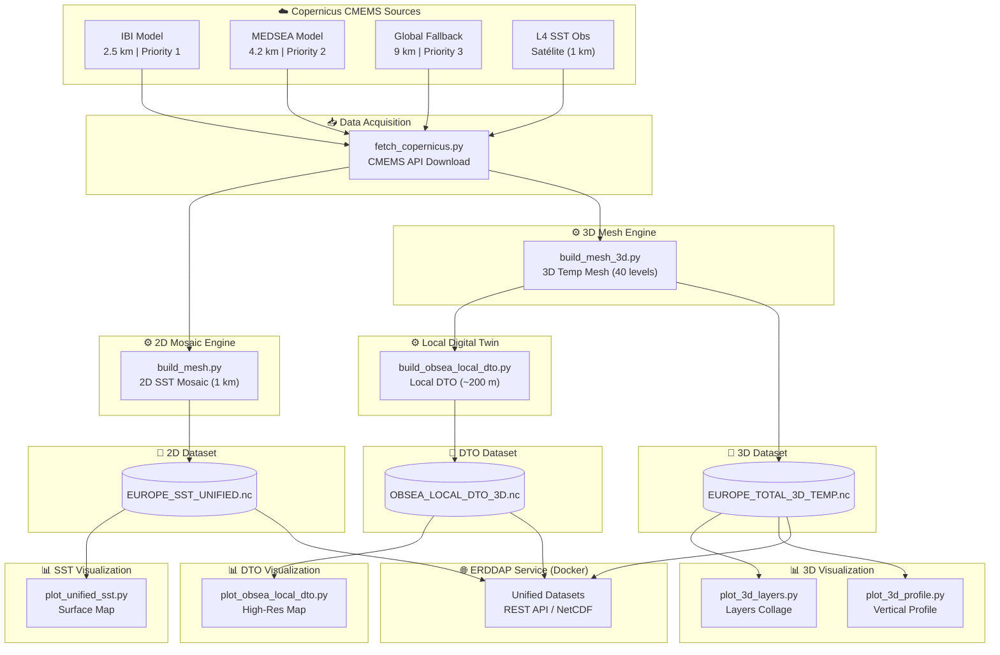

# ERDDAP – DEGI4ECO Project

[](https://marine.copernicus.eu/)
[](https://hub.docker.com/r/axiom/docker-erddap)
[](https://www.python.org/)
[](https://coastwatch.pfeg.noaa.gov/erddap/)

This repository manages a containerized **ERDDAP** service for high-resolution European ocean temperature data integration, 3D visualization, and local digital twin generation for the **OBSEA observatory** (Vilanova i la Geltrú, Catalonia).

The project extends the [Axiom docker-erddap](https://hub.docker.com/r/axiom/docker-erddap) architecture with a full geospatial data engineering pipeline: from Copernicus Marine ingestion, to hierarchical multi-basin merging, to scientific 3D layer visualization.

---

## System Architecture



> **Hierarchical Mosaic Logic**: IBI (highest priority, 2.5 km) fills cells first. MEDSEA covers the remaining Mediterranean. GLO serves as a full-domain fallback. This guarantees that OBSEA always receives the highest-resolution model available.

---

## Project Structure

```
erddap_digi4models/
├── conf/
│   ├── datasets.xml          ← ERDDAP dataset registry
│   ├── setup.xml             ← Server configuration
│   └── custom_logo.png
├── datasets/
│   ├── raw/                  ← Downloaded SST observations
│   ├── raw_3d/               ← Downloaded 3D physical models (IBI, MED...)
│   ├── unified_europe_sst/   ← EUROPE_SST_UNIFIED.nc
│   └── unified_europe_3d/    ← EUROPE_TOTAL_3D_TEMP.nc + OBSEA_LOCAL_DTO_3D.nc
├── erddapData/               ← ERDDAP internal state / logs
├── scripts/
│   ├── fetch_copernicus.py       ← Download from CMEMS
│   ├── build_mesh.py             ← 2D SST mosaic generation
│   ├── build_mesh_3d.py          ← 3D temperature mesh (40 levels)
│   ├── build_obsea_local_dto.py  ← High-res local DTO (~200m)
│   ├── plot_unified_sst.py       ← Surface temperature map
│   ├── plot_3d_layers.py         ← 3×3 native layer collage
│   ├── plot_3d_profile.py        ← Vertical profile at OBSEA
│   ├── plot_raw_comparison.py    ← IBI vs MEDSEA raw comparison
│   └── plot_obsea_local_dto.py   ← Local DTO visualization
├── main.py                       ← Orchestration entry-point
└── docker-compose.yaml
```

---

## Data Processing Pipeline

### 1. Data Acquisition — `fetch_copernicus.py`

Downloads required NetCDF files from the Copernicus Marine Service (CMEMS).
Requires Copernicus credentials configured via `copernicusmarine`.

| Type | Region | Product ID |
|------|--------|-----------|
| SST (2D) | Mediterranean | `SST_MED_SST_L4_NRT_OBSERVATIONS_010_004_a_V2` |
| SST (2D) | Baltic | `DMI-BALTIC-SST-L4-NRT-OBS_FULL_TIME_SERIE` |
| SST (2D) | Atlantic | `IFREMER-ATL-SST-L4-NRT-OBS_FULL_TIME_SERIE` |
| SST (2D) | Black Sea | `SST_BS_SST_L4_NRT_OBSERVATIONS_010_006_a_V2` |
| SST (2D) | Global fallback | `METOFFICE-GLO-SST-L4-NRT-OBS-SST-V2` |
| Thetao (3D) | Mediterranean | `cmems_mod_med_phy-tem_anfc_4.2km_P1D-m` |
| Thetao (3D) | Atlantic / IBI | `cmems_mod_ibi_phy_anfc_0.027deg-3D_P1D-m` |
| Thetao (3D) | Global | `cmems_mod_glo_phy-thetao_anfc_0.083deg_P1D-m` |

```bash
python scripts/fetch_copernicus.py
```

### 2. 2D SST Mosaic — `build_mesh.py`

Combines all regional SST observations into a unified **1 km resolution** European mosaic (`EUROPE_SST_UNIFIED.nc`) using the hierarchical priority strategy.

```bash
python scripts/build_mesh.py
```

### 3. 3D Temperature Mesh — `build_mesh_3d.py`

Builds a unified **40-level depth** temperature dataset from IBI + MEDSEA + GLO models (`EUROPE_TOTAL_3D_TEMP.nc`). Depth range: **1.02 m → 294 m**.

```bash
python scripts/build_mesh_3d.py
```

### 4. OBSEA Local Digital Twin — `build_obsea_local_dto.py`

Generates a high-resolution (~200 m) local subset of the IBI model centered around the **OBSEA observatory**:

- **Domain**: `[1.57°E – 1.90°E, 41.15°N – 41.26°N]`
- **Output**: `OBSEA_LOCAL_DTO_3D.nc`
- **Resolution**: 0.002° (~200 m)

```bash
python scripts/build_obsea_local_dto.py
```

---

## Scientific Visualization

| Script | Output | Description |
|--------|--------|-------------|
| `plot_unified_sst.py` | `unified_sst_map.png` | Full-domain surface temperature |
| `plot_3d_layers.py` | `temperature_layers_3d_v2.png` | 3×3 collage of native depth layers |
| `plot_3d_profile.py` | `obsea_3d_profile.png` | Vertical temperature profile at OBSEA |
| `plot_raw_comparison.py` | `raw_model_comparison.png` | IBI vs MEDSEA raw model comparison |
| `plot_obsea_local_dto.py` | `obsea_local_dto_surface.png` | High-res local DTO map |

---

## Running the ERDDAP Server

```bash
docker compose up -d
```

Access at: [http://localhost:8080/erddap](http://localhost:8080/erddap)

### Available ERDDAP Datasets

| Dataset ID | Description | Resolution |
|------------|-------------|------------|
| `unified_europe_sst` | European SST mosaic | ~1 km |
| `unified_europe_3d` | 3D temperature (40 levels) | ~4 km |
| `obsea_local_dto` | OBSEA local digital twin | ~200 m |

---

## Scientific Notes

- **Smart Selection (OBSEA)**: Profiles use the nearest cell with depth ≥ 20 m to avoid shoreline artefacts.
- **Native Fidelity**: Layer visualizations preserve native spatial resolution (2.5 km IBI / 4.2 km MEDSEA).
- **Land Masking**: White areas in local DTO maps represent land/bathymetric voids in the IBI model grid.

---

## Documentation

- [ERDDAP Setup Guide](https://coastwatch.pfeg.noaa.gov/erddap/download/setup.html)
- [datasets.xml Reference](https://coastwatch.pfeg.noaa.gov/erddap/download/setupDatasetsXml.html)
- [Copernicus Marine Toolbox](https://help.marine.copernicus.eu/en/collections/4060068-copernicus-marine-toolbox)

---

## Contact

**Author:** Oriol Prat  
**Affiliation:** Universitat Politècnica de Catalunya (UPC) — SARTI Group  
**Project:** DEGI4ECO  
**Email:** [oriol.prat.bayarri@upc.edu](mailto:oriol.prat.bayarri@upc.edu)
