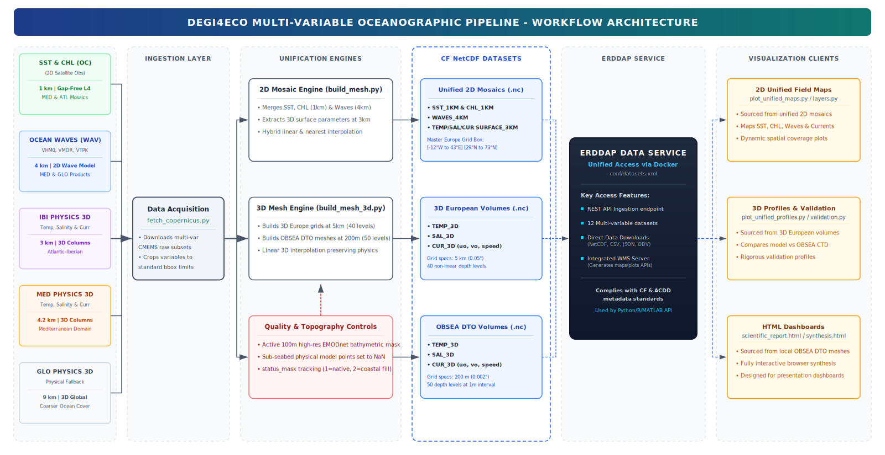

# ERDDAP – DEGI4ECO Project

[](https://marine.copernicus.eu/)
[](https://hub.docker.com/r/axiom/docker-erddap)
[](https://www.python.org/)
[](https://coastwatch.pfeg.noaa.gov/erddap/)

This repository manages a containerized **ERDDAP** service and a fully automated oceanographic data pipeline for the **DEGI4ECO** project. It ingests multi-variable, multi-source data from the Copernicus Marine Service (CMEMS) and fuses them into unified European grids serving as a **precursor Digital Twin of the Ocean (DTO)** — with a focus on the **OBSEA underwater observatory** (Vilanova i la Geltrú, Catalonia).

The system delivers five oceanographic variables at different resolutions across all European seas (Mediterranean, Atlantic, Baltic, Black Sea, Global), consolidated into monthly NetCDF archives and served daily via ERDDAP.

---

## System Architecture



> **Mosaic Priority Logic**: Regional products are fused using a priority queue (e.g. MED → ATL → BAL → BS → GLO). Higher-priority regions fill first; gaps are covered by lower-priority sources via hybrid linear+nearest interpolation. A `status_mask` variable encodes data provenance (1 = native, 2 = extrapolated).

---

## Project Structure

```
erddap_digi4models/
├── pipeline/
│   ├── config.py               ← All CMEMS product IDs, resolutions, priorities (P1D + PT1H)
│   ├── fetch_copernicus.py     ← Download from CMEMS with MY/REP fallback heuristic
│   ├── build_mesh.py           ← 2D/surface mosaic engine (daily & hourly modes)
│   ├── build_mesh_3d.py        ← 3D volume mesh (40 depth levels, Europe)
│   ├── predict_future.py       ← Extends datasets to end of next month with prediction flag
│   └── fetch_bathymetry.py     ← EMODnet bathymetry download
├── visualization/
│   ├── plot_unified_maps.py    ← Surface maps (Europe + OBSEA zoom)
│   ├── plot_unified_profiles.py← Vertical profiles at OBSEA
│   ├── plot_unified_layers.py  ← 3D depth-layer collages
│   └── plot_data_availability.py ← Dataset coverage Gantt chart
├── conf/
│   ├── datasets.xml            ← ERDDAP dataset registry
│   └── setup.xml               ← ERDDAP server configuration
├── datasets/
│   ├── raw/                    ← Raw NetCDF downloads per variable/region
│   ├── unified_europe_sst/     ← Monthly: EUROPE_TOTAL_1KM_P1D_sst_YYYYMM.nc
│   ├── unified_europe_chl/     ← Monthly: EUROPE_TOTAL_1KM_P1D_chl_YYYYMM.nc
│   ├── unified_europe_waves/   ← Monthly: EUROPE_TOTAL_4KM_P1D_waves_YYYYMM.nc
│   ├── unified_europe_sal_surface/  ← Monthly: EUROPE_TOTAL_3KM_P1D_sal_surface_YYYYMM.nc
│   ├── unified_europe_cur_surface/  ← Monthly: EUROPE_TOTAL_3KM_P1D_cur_surface_YYYYMM.nc
│   └── bathymetry/             ← EMODnet bathymetry per domain
├── main.py                     ← Orchestration entry-point (--mode daily|hourly)
├── daily_automation.sh         ← Cron-ready full pipeline script
├── consolidate_to_monthly.py   ← Merge daily NetCDF files into monthly archives
├── fetch_remaining_historical.py ← One-off historical backfill (Apr–May 2026)
├── fetch_april_may_all.py      ← Full Apr–May 2026 backfill for all 2D variables
├── check_erddap.py             ← Trigger ERDDAP forceReload
├── check_nc_times.py           ← Validate time-dimension coverage in NetCDF files
├── erddapData/                 ← ERDDAP internal state / logs
└── docker-compose.yaml
```

---

## Variables & CMEMS Products

Two pipeline modes are available, selectable via `--mode` argument or `PIPELINE_MODE` env variable:

### Mode `daily` — P1D products (default, operational)

| Variable | Resolution | Regions | Notes |
|---|---|---|---|
| **SST** | 1 km | MED, BAL, ATL, BS, GLO | L4 satellite composite |
| **CHL** | 1 km | MED, ATL, BS, GLO | L4 gap-free ocean color |
| **Waves** | 4 km | MED, BS, GLO | VHM0, VMDR, VTPK |
| **Salinity** | ~3 km | MED, ATL, BAL, BS, GLO | 3D model, surface extraction |
| **Currents** | ~3 km | MED, ATL, BAL, BS, GLO | 3D model, uo+vo+speed |

### Mode `hourly` — PT1H products (high-frequency)

| Variable | Temporal Res | Notes |
|---|---|---|
| **SST** | PT1H | Mixed: satellite L4 (MED/BS) + physical model 2D (ATL/BAL/GLO) |
| **CHL** | PT1H (forward-filled) | No true hourly product — daily value replicated per hour |
| **Waves** | PT1H / PT3H (GLO) | Regional seas hourly; global 3-hourly |
| **Salinity / Currents / Temp** | PT1H | Physical model instantaneous |

> All mosaics include two metadata variables:
> - `status_mask`: 0=empty, 1=native data, 2=extrapolated (nearest-neighbor fill)
> - `prediction_flag`: 0=historical/real, 1=model projection

---

## Quick Start

### 1. Clone and install

```bash
git clone https://github.com/uripratt/erdap_digi4eco.git erddap_digi4models
cd erddap_digi4models
python3 -m venv venv_digi4eco
source venv_digi4eco/bin/activate
pip install copernicusmarine xarray netCDF4 numpy pandas dask matplotlib contextily
```

### 2. Configure Copernicus credentials

```bash
copernicusmarine login
```

### 3. Run the pipeline (NRT daily, all variables)

```bash
python main.py --mode daily
```

### 4. Run for a specific variable only

```bash
python main.py --mode daily --vars sst chl --days 7
```

### 5. Historical backfill (Apr–May 2026, all 2D variables)

```bash
nohup python fetch_april_may_all.py > backfill.log 2>&1 &
```

### 6. Generate future predictions (to end of next month)

```bash
python pipeline/predict_future.py --mode daily
```

### 7. Run the ERDDAP server

```bash
docker compose up -d
# Access at: http://localhost:8080/erddap
```

---

## Daily Automation (Cron)

`daily_automation.sh` orchestrates the full NRT lifecycle:

1. **Fetch** — Download last 1–7 days from CMEMS per variable
2. **Build mesh** — Fuse regional products into unified European mosaics
3. **Predict** — Extend datasets to end of next month (`prediction_flag=1`)
4. **Consolidate** — Merge daily NetCDF files into monthly archives
5. **Reload** — Trigger ERDDAP `forceReload` to expose new data

```bash
# Manual run (daily mode)
./daily_automation.sh

# Manual run (hourly mode)
PIPELINE_MODE=hourly ./daily_automation.sh

# Schedule via cron (runs at 03:00 every day)
crontab -e
# Add:
# 0 3 * * * cd /path/to/erdap_digi4eco && source venv_digi4eco/bin/activate && PIPELINE_MODE=daily bash daily_automation.sh >> cron_digi4eco.log 2>&1
```

> ⚠️ Data cleanup (removal of files older than 2 months) is **disabled by default**. Enable by uncommenting Step 6 in `daily_automation.sh`.

---

## Available ERDDAP Datasets

| Dataset ID | Variable | Resolution | Temporal |
|---|---|---|---|
| `unified_europe_sst` | Sea Surface Temperature | 1 km | Daily |
| `unified_europe_chl` | Chlorophyll-a | 1 km | Daily |
| `unified_europe_waves` | Wave Height / Direction / Period | 4 km | Daily |
| `unified_europe_sal_surface` | Surface Salinity | ~3 km | Daily |
| `unified_europe_cur_surface` | Surface Currents (uo, vo, speed) | ~3 km | Daily |

Each dataset covers the full European domain `[-12°E, 29°N] → [43°E, 73°N]` and includes a prediction extension to the end of the following month, ensuring ERDDAP always serves data for future dates.

---

## Output Naming Convention

Monthly NetCDF files follow this pattern:

```
EUROPE_TOTAL_{RES}KM_{TEMPORAL_RES}_{VARIABLE}_{YYYYMM}.nc
```

Examples:
- `EUROPE_TOTAL_1KM_P1D_sst_202606.nc`
- `EUROPE_TOTAL_4KM_P1D_waves_202605.nc`
- `EUROPE_TOTAL_3KM_P1D_sal_surface_202604.nc`
- `EUROPE_TOTAL_1KM_PT1H_sst_202606.nc` ← hourly mode

---

## Scientific Notes

- **MY/REP fallback**: When NRT products fail or are out of date, `fetch_copernicus.py` automatically retries with the validated Multi-Year (`_my_`) or Reprocessed (`_REP_`) equivalent product ID.
- **NRT 1-day lag**: All NRT products are queried up to yesterday to avoid time-exceed errors (standard latency for L4 composites).
- **Hybrid interpolation**: Each regional layer is first interpolated linearly onto the master grid, then NaN gaps are filled with nearest-neighbor to ensure seamless coast coverage.
- **CHL forward-fill (hourly mode)**: No true hourly chlorophyll product exists in CMEMS. In PT1H mode, the daily value is replicated for all 24 hours of that day.
- **Land masking**: Land cells remain as `NaN`. The `status_mask=0` flag identifies genuinely empty ocean cells.

---

## Documentation

- [ERDDAP Setup Guide](https://coastwatch.pfeg.noaa.gov/erddap/download/setup.html)
- [datasets.xml Reference](https://coastwatch.pfeg.noaa.gov/erddap/download/setupDatasetsXml.html)
- [Copernicus Marine Toolbox](https://help.marine.copernicus.eu/en/collections/4060068-copernicus-marine-toolbox)
- [CMEMS Product Catalogue](https://data.marine.copernicus.eu/products)

---

## Contact

**Author:** Oriol Prat
**Affiliation:** Universitat Politècnica de Catalunya (UPC) — SARTI Group
**Project:** DEGI4ECO
**Email:** [oriol.prat.bayarri@upc.edu](mailto:oriol.prat.bayarri@upc.edu)
